# Cricket Expert Chatbot Application - Retrieval-Augmented Generation, Amazon Bedrock

Scroll down to skip to app demo

## Description:
This application uses Retrieval-Augmented Generation (RAG) to provide accurate cricket-related answers by combining document retrieval with generative AI. The admin uploads PDFs, which are split into chunks, vectorized, and saved as indices in an S3 bucket using the Titan Embedding Model. Users query the chatbot, which downloads the index files, builds a local vector store, performs similarity searches to retrieve relevant documents, and uses a prompt template to generate responses from the Large Language Model (LLM).

## Stack:
Python, Docker, Amazon Bedrock, LangChain, Amazon S3

## Models:

1. Amazon Titan Text Embeddings V1
2. Amazon Titan Text Lite

## Application Workflow:

### Admin - Uploads PDF

    └── PDF Split
        └── Distributed in Chunks 
            └── Vectorized
                └── Titan Embedding Model leveraged to create vector representation
                    └── Save indices (S3 Bucket)

### User - Query passed in chatbot input

    └── Index files are downloaded from S3 and saved locally to build vector store
        └── Langchain RetrievalQA
            └── Saved Embedding Model leveraged to convert query into vector embedding
                └── Similarity Search executed
                    └── Gets back 5 matching documents and builds context
                        └── Leverage prompt template to provide query and context to LLM
                            └── Shows LLM output

## App Demo with Screenshots: 

### 1) Inital Admin Page 🖥️ 
   
   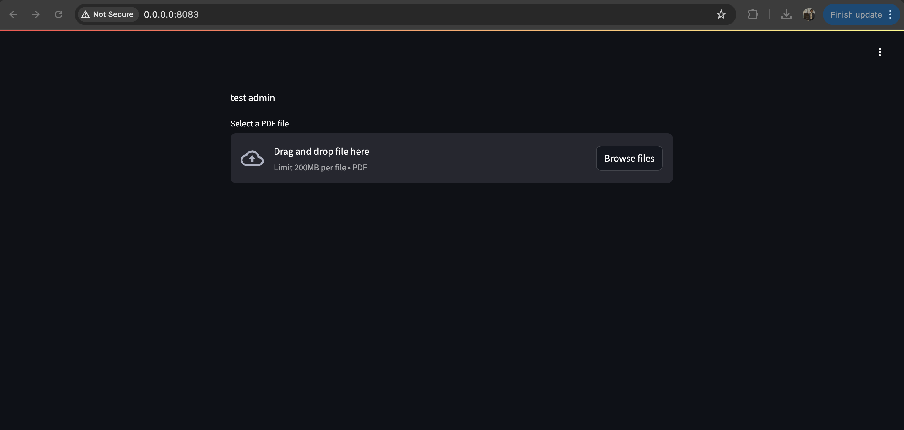
   
   

### 2) PDF uploaded by user, vector store creation in progress 📄
   
   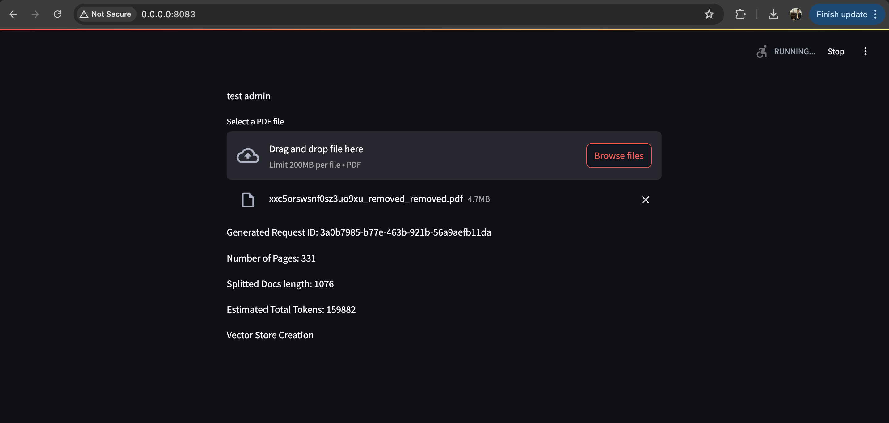
   
   

### 3) Vector store creation completed ✅
   
   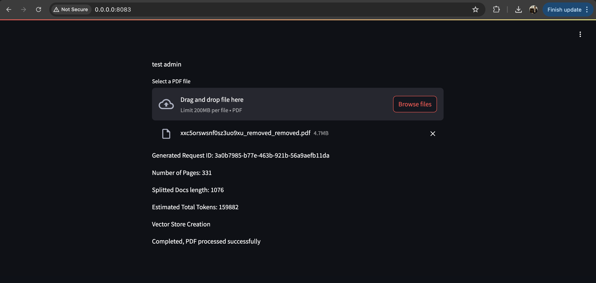
   
   

### 4) Indices in S3 bucket 🪣
   
   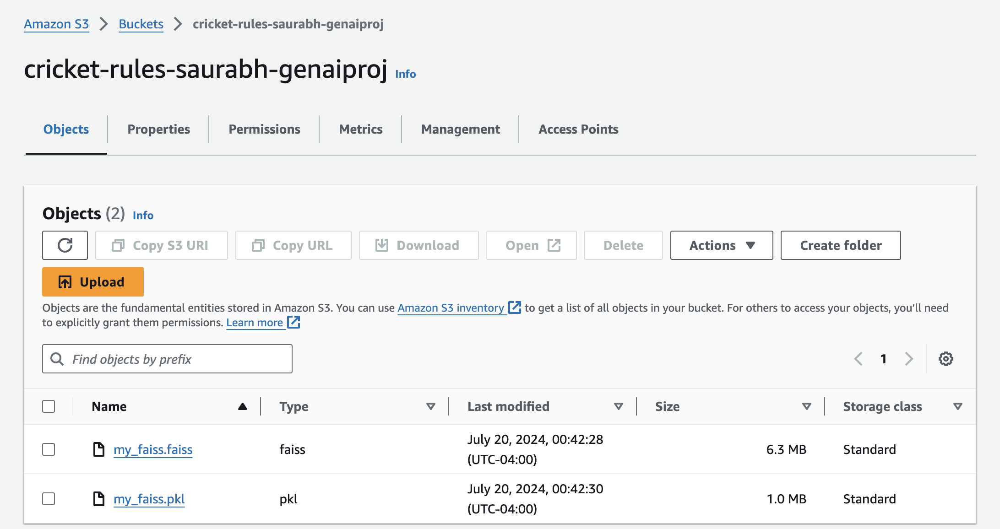
   
   

### 5) Inital User Page 🖥️ 
   
   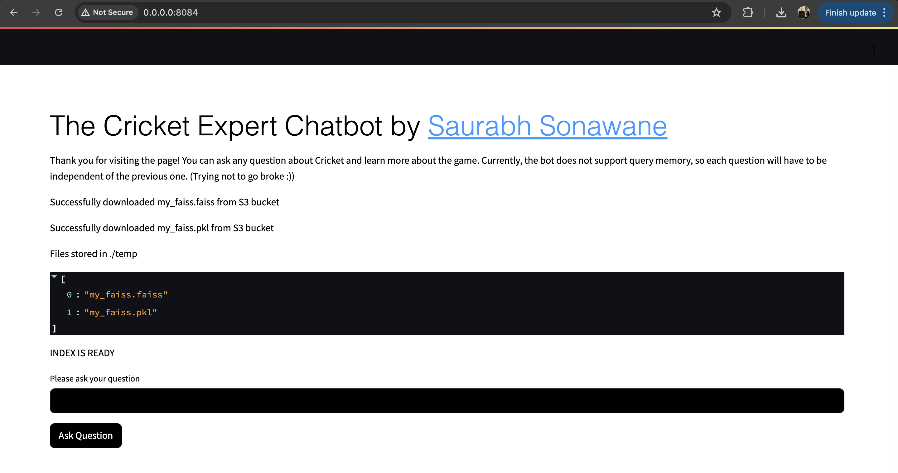
   
   

### 6) Query 1 Demo 🔍
   
   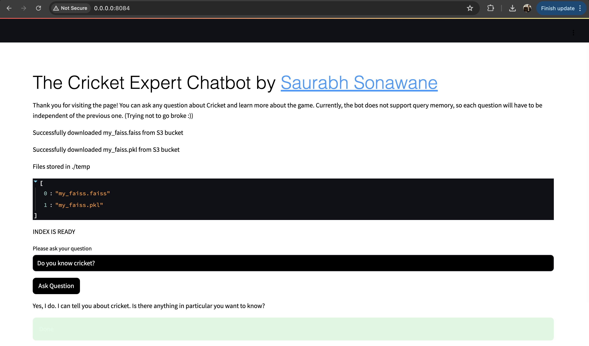
   
   

### 7) Query 2 Demo 🔍
   
   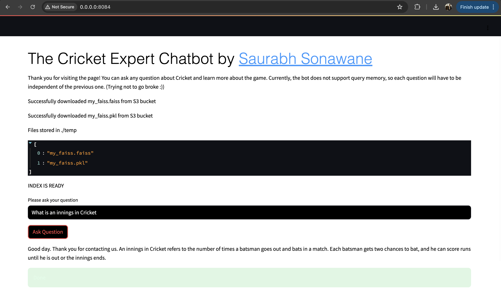
   
   

### 8) Query 3 Demo 🔍
   
   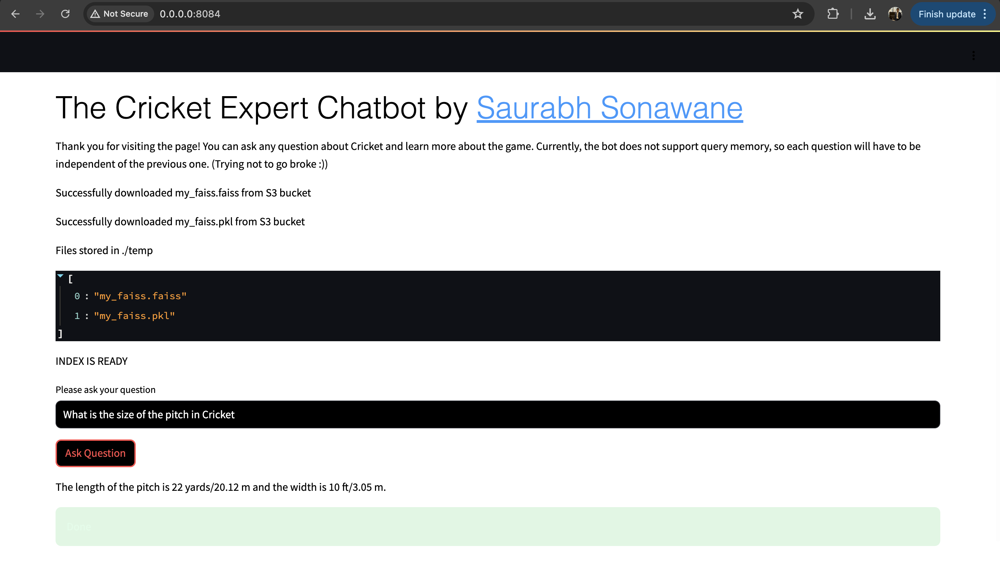
   
   

### 9) Query 4 Demo 🔍
   
   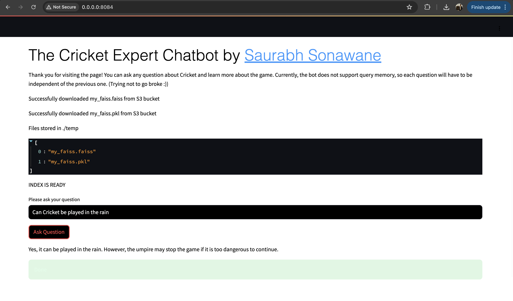
   
   

### 10) Query 5 Demo 🔍
   
   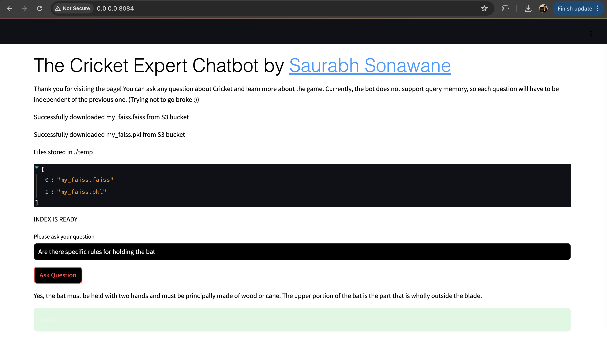
   
   

### 11) Query 6 Demo 🔍
   
   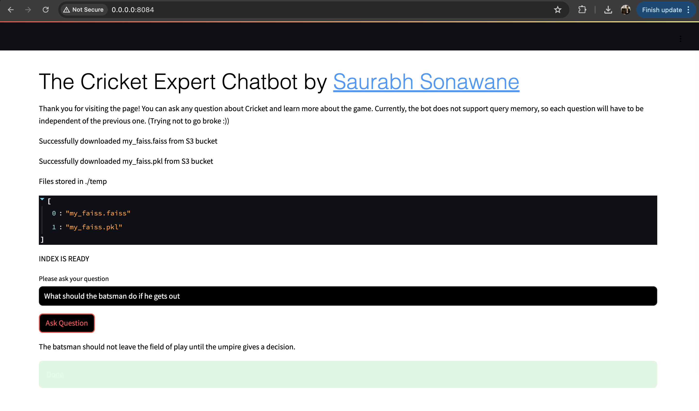
   
   

### 12) Query 7 Demo 🔍
   
   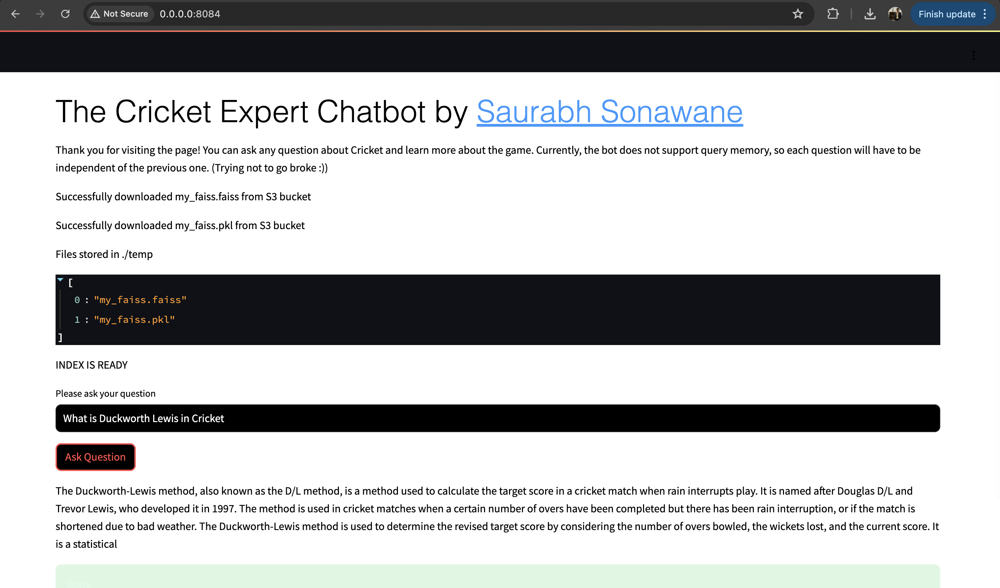
   
   

### 13) Query 8 Demo 🔍
   
   
   
   

### 14) Query 9 Demo 🔍
   
   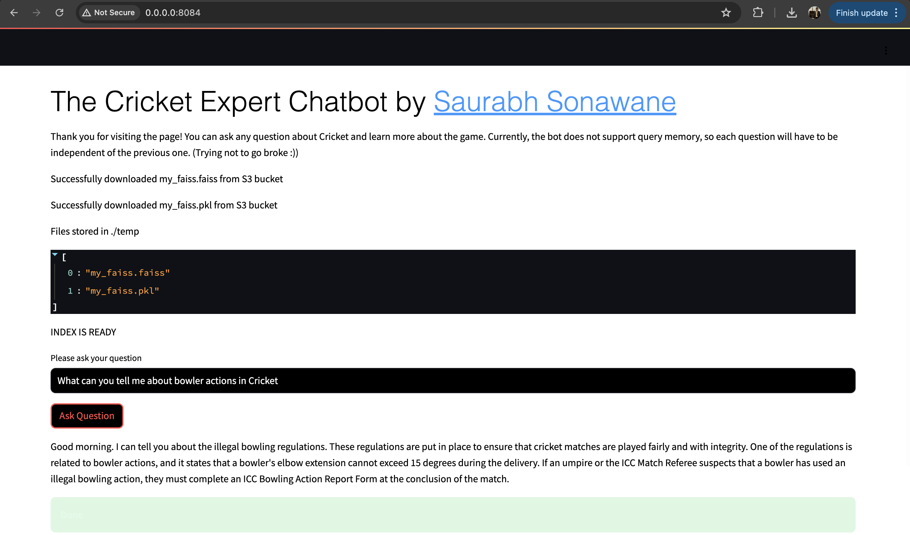

